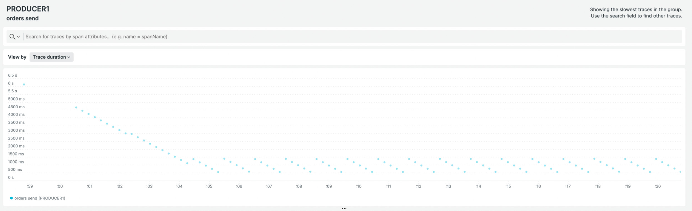
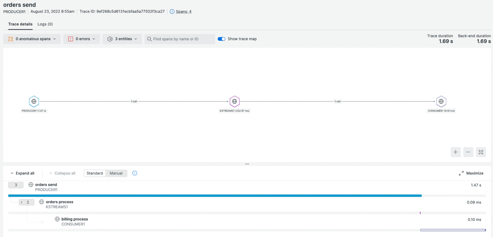
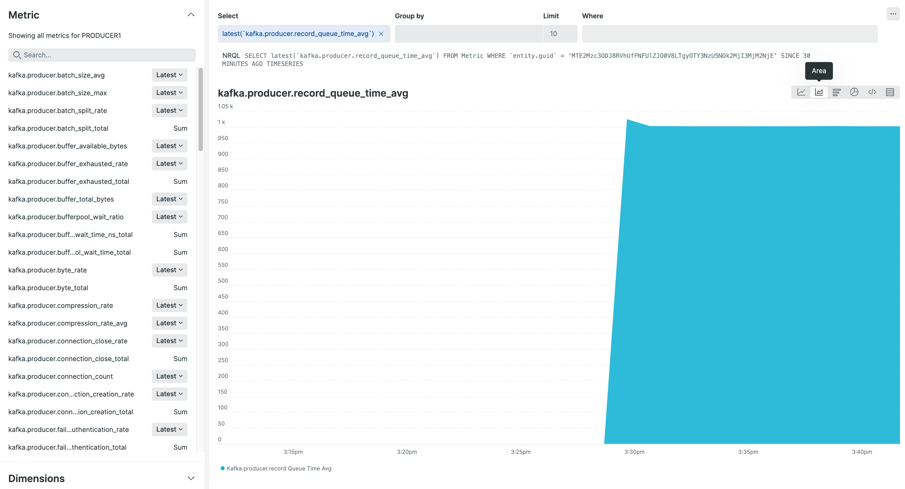

# Overview

This is a demo to show the [OpenTelemetry Java Agent] working with Kafka apps.
There are three different applications in
`src/main/java/io/confluent/examples/clients/cloud/`:

- ProducerExample: it generates random events in the `orders` topic.
- StreamsExample: KStreams app consuming from `orders` topic, applying a simple
  transformation and producting to the `billing` topic.
- ConsumerExample: it reads from the `billing` topic and it prints the message
  in the console

The demo adds the [OpenTelemetry Java Agent] and it shows how to use it
for distributed tracing and Kafka Client metrics.

# Setup

The demo requires a Kafka cluster. You can run it locally or use a Cloud
service. See the [CCloud Terraform example] for a setup of the topics, ACLs,
etc.

# Add the OpenTelemetry Agent

The agent has been downloaded in the `lib` folder. To add it to the applications
when launched from Maven add the following environment variable:

```sh
export MAVEN_OPTS="-javaagent:$PWD/lib/opentelemetry-javaagent.jar"
```

It requires some variables to configure to where apps are going to send metrics
and traces. In the case of New Relic (US accounts):

```sh
export OTEL_EXPORTER_OTLP_ENDPOINT="https://otlp.nr-data.net:4317"
export OTEL_EXPORTER_OTLP_HEADERS=api-key=YOUR-API-KEY
```

You can use any other OpenTelemetry compliant platform. See [NewRelic
OpenTelemetry setup] for more info.

Now we can launch the applications:

Consumer:

```sh
export OTEL_SERVICE_NAME=CONSUMER1
mvn exec:java -Dexec.mainClass="io.confluent.examples.clients.cloud.ConsumerExample" -Dexec.args="consumer.config billing"
```

KStreams:

```sh
export OTEL_SERVICE_NAME=KSTREAMS1
mvn exec:java -Dexec.mainClass="io.confluent.examples.clients.cloud.StreamsExample" -Dexec.args="kstreams.config orders"
```

Producer:

```sh
export OTEL_SERVICE_NAME=PRODUCER1
mvn exec:java -Dexec.mainClass="io.confluent.examples.clients.cloud.ProducerExample" -Dexec.args="producer.config orders"
```

In the UI, you should be able to see the Kafka distributed traces:





See [Understand and use the distributed tracing UI] for more information about
Distributed Tracing in New Relic.

# Sampling

Traces can be quite costly in high-throughput pipelines. It's possible to
configure sampling to avoid a big part of that cost with the following
environment variables:

```sh
export OTEL_TRACES_SAMPLER=parentbased_traceidratio
export OTEL_TRACES_SAMPLER_ARG=0.3
```

See [Sampler] for more info.


# Kafka Client metrics

Distributed traces are ideal to identify bottlenecks but they aren't so useful
to solve them. Kafka Client metrics are a better tool for that. The Agent is
also able to retrieve them with minimal configuration.

Add the following variables:

```sh
export OTEL_METRIC_EXPORT_INTERVAL=1000
export OTEL_EXPORTER_OTLP_METRICS_TEMPORALITY_PREFERENCE=delta
```

`OTEL_METRIC_EXPORT_INTERVAL` is used to send the metrics before the producer
ends. `OTEL_EXPORTER_OTLP_METRICS_TEMPORALITY_PREFERENCE` is used in the
context of New Relic, it may be optional with others platforms.

Now we add it as Maven dependency:

```xml
<dependency>
    <groupId>io.opentelemetry.instrumentation</groupId>
    <artifactId>opentelemetry-kafka-clients-2.6</artifactId>
    <version>1.17.0-alpha-SNAPSHOT</version>
</dependency>
```

and to the Producer properties:

```java
KafkaTelemetry kafkaTelemetry = KafkaTelemetry.create(GlobalOpenTelemetry.get());
props.putAll(kafkaTelemetry.metricConfigProperties());
```

If we launch again the producer, we should be able to see the Kafka metrics
in the UI:



See [Instrumenting Kafka clients with OpenTelemetry] for more info.

[OpenTelemetry Java Agent]: https://github.com/open-telemetry/opentelemetry-java-instrumentation
[CCloud Terraform example]: https://github.com/antonmry/kafka-playground/tree/main/terraform/ccloud
[NewRelic OpenTelemetry setup]: https://docs.newrelic.com/docs/more-integrations/open-source-telemetry-integrations/opentelemetry/opentelemetry-setup/
[Understand and use the distributed tracing UI]: https://docs.newrelic.com/docs/distributed-tracing/ui-data/understand-use-distributed-tracing-ui/
[Instrumenting Kafka clients with OpenTelemetry]: https://github.com/open-telemetry/opentelemetry-java-instrumentation/blob/main/instrumentation/kafka/kafka-clients/README.md
[Sampler]: https://github.com/open-telemetry/opentelemetry-java/blob/main/sdk-extensions/autoconfigure/README.md#sampler
